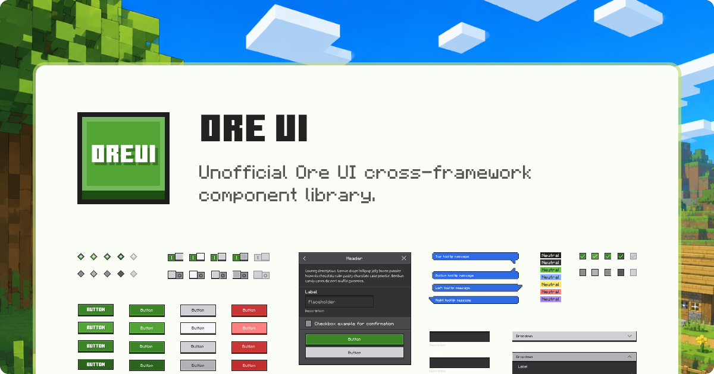

 

<h1>
  OreUI
</h1>

  非官方 Ore UI 跨框架组件库，将 Ore UI 设计系统应用到您的项目中。

[![Pull Requests][github-pr-badge]][github-pr-link]
[![Issues][github-issue-badge]][github-issue-link]
[![License][github-license-badge]](LICENSE)
[![Build][github-build-badge]][github-build-link]
[![Release][github-release-badge]][github-release-link]

[English](README.md) · **简体中文**

<!-- Main Body -->

## 介绍
OreUI 是一个非官方粉丝向的组件库，将 Minecraft 的 Ore UI 设计系统应用到您的 Web 项目中。

包含超过 25 个组件，共享一个与框架无关的 Web Component 核心，并对特定框架提供轻量适配。

完整文档请访问 [katorly.dev/OreUI](https://katorly.dev/OreUI/docs)。

### 特性
- **跨框架**：支持 Vanilla JavaScript、React、Vue 等
- **CSS 优先**：专注视觉设计，仅使用少量 JavaScript
- **精简核心**：Lit 是唯一的运行时依赖
- **自定义程度高**：使用 CSS 变量、TailwindCSS、PandaCSS 和 Props 进行自定义
- **无障碍**：支持语义化 HTML、键盘操作、焦点管理和 ARIA

## 软件包
| 软件包 | 版本 | 下载量 | 链接 |
| ------ | ---- | ------ | ---- |
|  `oreui-web` |  |  | [文档](https://katorly.dev/OreUI/docs/getting-started/vanilla) · [源码](https://github.com/katorlys/OreUI) |
|  `@oreui-web/react` |  |  | [文档](https://katorly.dev/OreUI/docs/getting-started/react) · [源码](https://github.com/katorlys/OreUI/tree/main/packages/react) |
|  `@oreui-web/vue` |  |  | [文档](https://katorly.dev/OreUI/docs/getting-started/vue) · [源码](https://github.com/katorlys/OreUI/tree/main/packages/vue) |
|  `@oreui-web/svelte` |  |  | [文档](https://katorly.dev/OreUI/zh-CN/docs/getting-started/svelte) · [源码](https://github.com/katorlys/OreUI/tree/main/packages/svelte) |

## 开始使用
在[快速开始](https://katorly.dev/OreUI/docs/getting-started)中选择框架，或浏览[所有组件](https://katorly.dev/OreUI/docs/overview)。

## 参与贡献
向 OreUI 贡献代码，请访问[贡献指南](https://katorly.dev/OreUI/docs/contributing)。

## 法律声明
OreUI 是一个**非官方**的爱好者项目，不是官方 Ore UI 的替代产品，也未经 Mojang 或 Microsoft 批准或关联。使用本项目时，请同时遵守 [Minecraft EULA](https://www.minecraft.net/eula) 及其他适用条款。

本项目只参考官方 Ore UI 的视觉风格。除字体外，项目中的代码和资源均为独立制作，不包含官方 Ore UI 的源代码。

<!-- /Main Body -->

  
[![BACK TO TOP][back-to-top-button]](#readme-top)

---

  Copyright &copy; 2026-present <a target="_blank" href="https://github.com/katorlys">Katorly Lab</a>

[![License][github-license-badge-bottom]](LICENSE)

[back-to-top-button]: https://img.shields.io/badge/BACK_TO_TOP-151515?style=flat-square
[github-pr-badge]: https://img.shields.io/github/issues-pr/katorlys/OreUI?label=pulls&labelColor=151515&color=79E096&style=flat-square
[github-pr-link]: https://github.com/katorlys/OreUI/pulls
[github-issue-badge]: https://img.shields.io/github/issues/katorlys/OreUI?labelColor=151515&color=FFC868&style=flat-square
[github-issue-link]: https://github.com/katorlys/OreUI/issues
[github-license-badge]: https://img.shields.io/github/license/katorlys/OreUI?labelColor=151515&color=EFEFEF&style=flat-square
<!-- https://img.shields.io/badge/license-CC_BY--NC--SA_4.0-EFEFEF?labelColor=151515&style=flat-square -->
[github-license-badge-bottom]: https://img.shields.io/github/license/katorlys/OreUI?labelColor=151515&color=EFEFEF&style=for-the-badge
<!-- https://img.shields.io/badge/license-CC_BY--NC--SA_4.0-EFEFEF?labelColor=151515&style=for-the-badge -->
[github-build-badge]: https://img.shields.io/github/actions/workflow/status/katorlys/OreUI/release.yml?labelColor=151515&style=flat-square
[github-build-link]: https://github.com/katorlys/OreUI/actions/workflows/release.yml
[github-release-badge]: https://img.shields.io/github/v/release/katorlys/OreUI?include_prereleases&labelColor=151515&color=8DD1E0&style=flat-square
[github-release-link]: https://github.com/katorlys/OreUI/releases/latest
